# Results

## Logistic Regression

As the logistic regression model is implemented using statsmodels, it allows us to gather more detailed metrics about the model.
For example, using p-values with the significance level of 0.05 we can see that out of the features, **"balance"** and **"f0_std"** are statistically significant, with a p-value of less than or equal to 0.05. The coefficient of "balance" is also clearly the most significant. This implies that TED-speakers have lower balance-values, meaning that their speeches contain more pauses. The coefficient of "f0_std" is much less significant, but it does imply that TED-speakers tend to have more pitch variability.

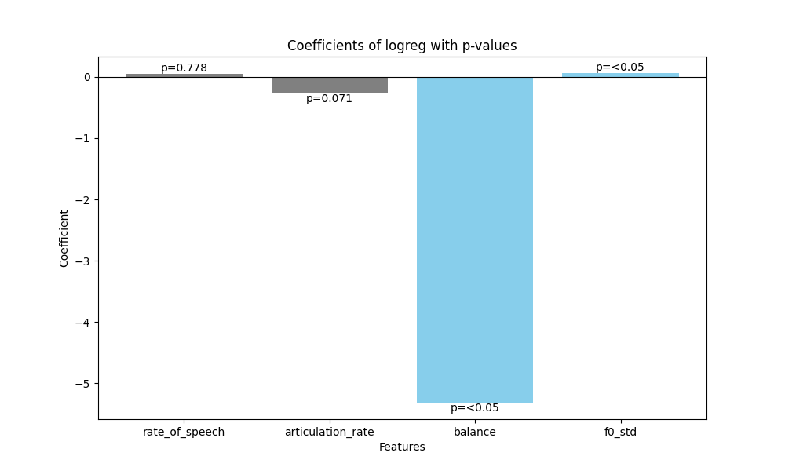

The confusion matrix of the model show that the model does make a significant amount of wrong classifications, which tend to be equally distributed between the classes. The overall accuracy **0.6836 ± 0.0253** of the model is decent.

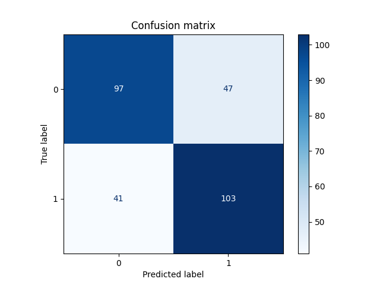

The ROC curve gives a slightly better perspective, with an AUC of **0.76 ± 0.03**, suggesting a good ability to distinguish between TED and non-TED talks.

Lastly, the Pseudo R-squared value of **0.1479 ± 0.0103** indicates a moderate explanatory power.

## Random Forest

Interestingly, the feature importance values of the random forest model are noticeably different to the logreg model's coefficients. Mainly, the importance of **"f0_std"** is clearly the largest, with **"balance"** coming second at a significantly lower value. The other two remain relatively insignificant. This indicates that, according to the random forest, pitch variability plays a dominant role in partitioning the data across the trees.

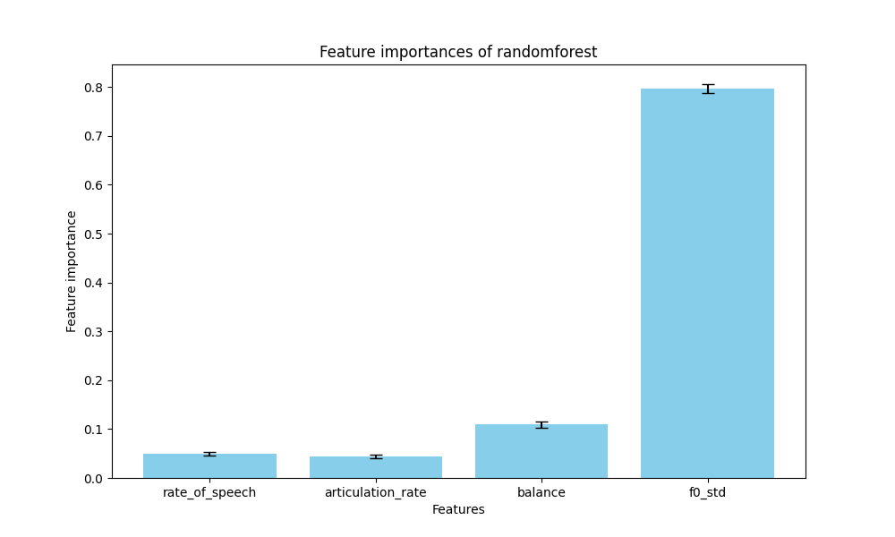

The confusion matrix is quite similar to the logreg model, but there is a noticeable drop in overall accuracy, down to around **0.6488 ± 0.0198**.

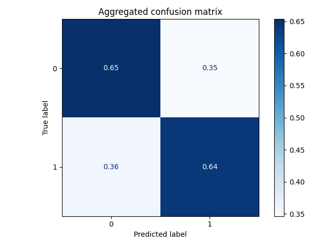

As with the logistic regression model, the ROC curve gives a slightly better rating, with an AUC of **0.72 ± 0.02**, also suggesting a good ability to distinguish between TED and non-TED talks.

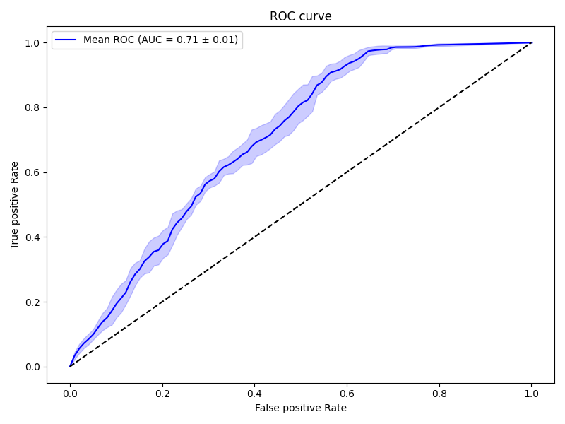

## Support Vector Machine (SVM)

Again the feature importance stays the same as in previous models. **"f0_std"** is again the highest at 0.66 and **"balance"** at the second place at 0.22. The two other features are staying at around 0.05.

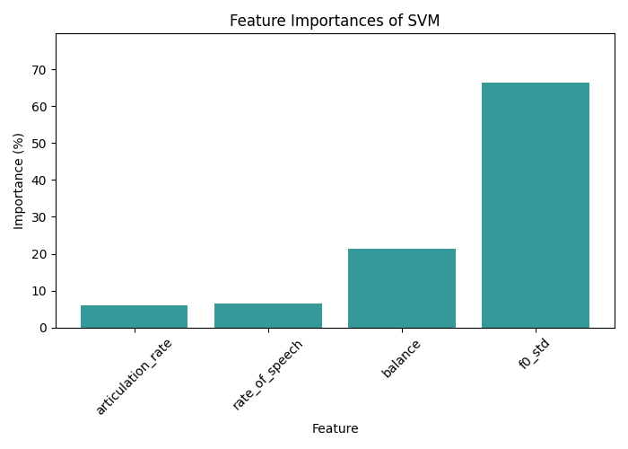

The overall accuracy is around **74%**. The confusion matrix has some differences because it is predicting more TED:s vs NON-TED:s than the previous models. Also the is differences in precision, recall and f1-score between 0 and 1 classifications but is still they are looking alright.

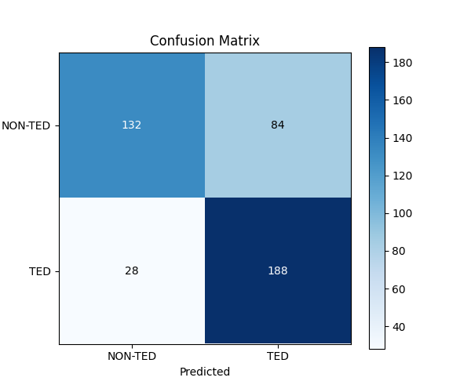

|              |   precision |   recall |   f1-score |    support |
|:-------------|------------:|---------:|-----------:|-----------:|
| 0            |    0.82     | 0.61     |   0.70     | 216        |
| 1            |    0.69     | 0.87     |   0.77     | 216        |
| accuracy     |             |          |   0.74     | 432        |
| macro avg    |    0.76     | 0.74     |   0.74     | 432        |
| weighted avg |    0.76     | 0.74     |   0.74     | 432        |

The ROC curve gives a slightly better perspective, with an AUC of **0.79**, suggesting a good ability to distinguish between TED and non-TED talks. Almost over 0.8 which would have been generally considered a good model.

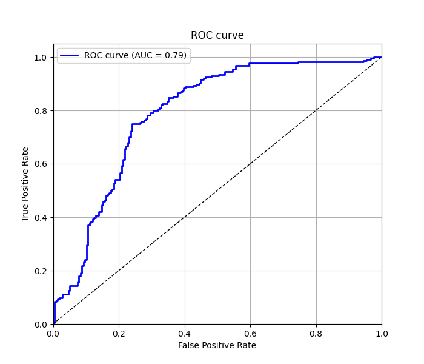

Using K-Fold, with five folds the SVM model achieved a mean accuracy of **71%** with a low standard deviation of **1.44%**. This indicates that the model's performance is stable and consistent with different data splits.

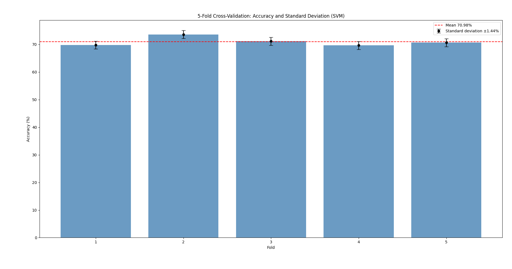

Below we can see how the **"f0_std"** really affects in the classification with SVM.

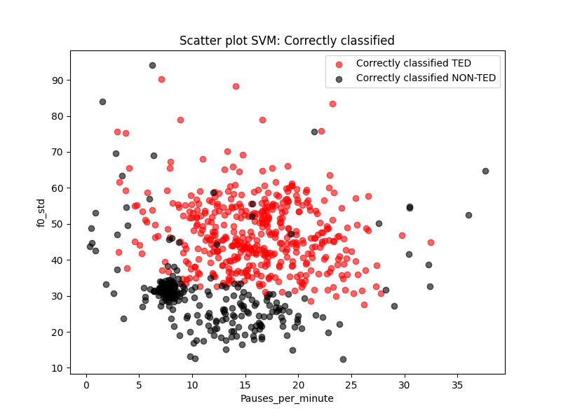

## K-nearest neighbors (KNN)

Again **"f0_std"** is the most important feature at 0.46 but now **"rate_of_speech"** is at second place at 0.27. **"balance"** is also up there at 0.2 and lastly **"articulation_rate"** at 0.065.

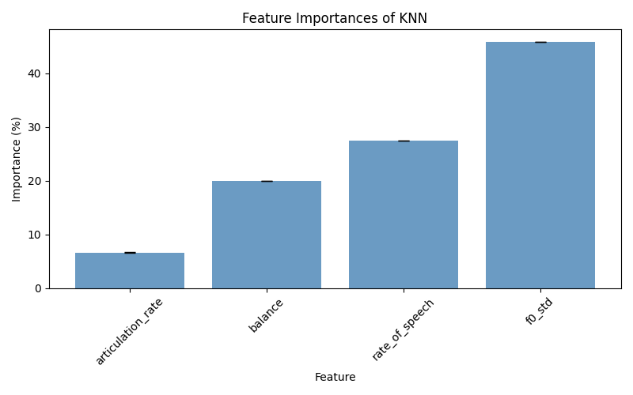

The overall accuracy is around **70%**. Again the confusion matrix has some differences because it is predicting more TED:s vs NON-TED:s than the first 2 models, but is similar to SVM. Also the is differences in precision, recall and f1-score between 0 and 1 classifications but is still they are looking alright.

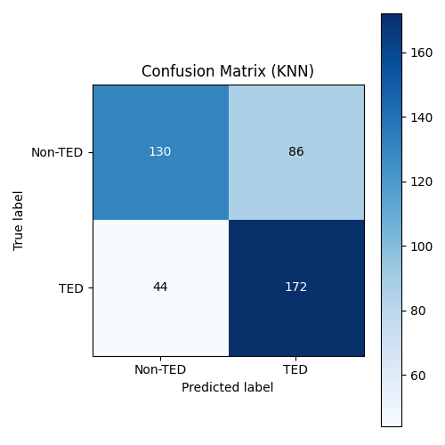

|              |   precision |   recall |   f1-score |    support |
|:-------------|------------:|---------:|-----------:|-----------:|
| 0            |    0.75     | 0.60     |   0.67     | 216        |
| 1            |    0.67     | 0.80     |   0.73     | 216        |
| accuracy     |             |          |   0.70     | 432        |
| macro avg    |    0.71     | 0.70     |   0.70     | 432        |
| weighted avg |    0.71     | 0.70     |   0.70     | 432        |

The ROC curve is quite similar with the SVM, with an AUC of **0.76**, suggesting a good ability to distinguish between TED and non-TED talks.

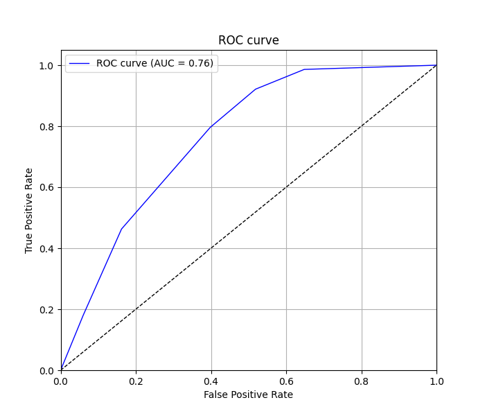

Using K-Fold, with five folds the KNN model achieved a mean accuracy of **66.7%** with a standard deviation of **2.8%**. This indicates that the model's performance is not as good as in SVM for example, but can still make quite good predictions with different data splits.

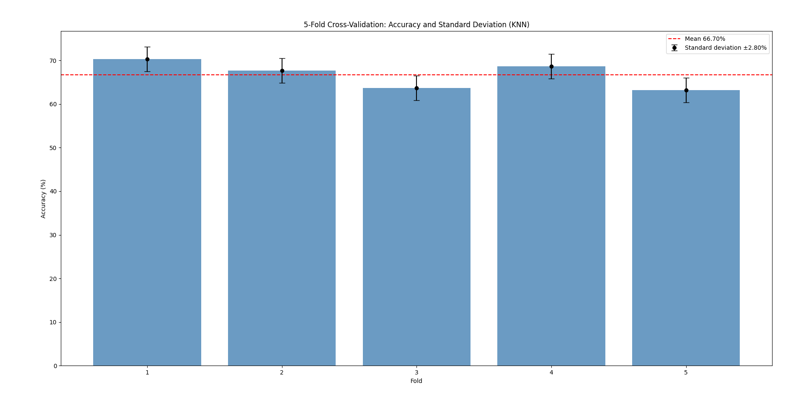

## Comparison between model accuracies

In a graph showing a 95% confidence interval for the accuracies, the models are in a distinct order and can thus be ranked easily. **SVM is clearly the most accurate**, being the only model to achieve a mean accuracy of over 70%. It also has the lowest spread of the models.

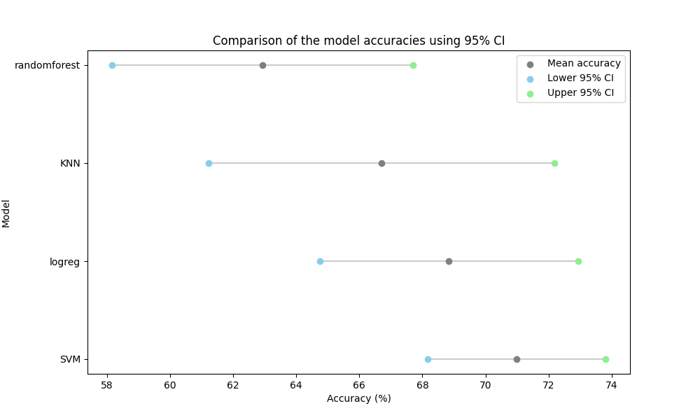